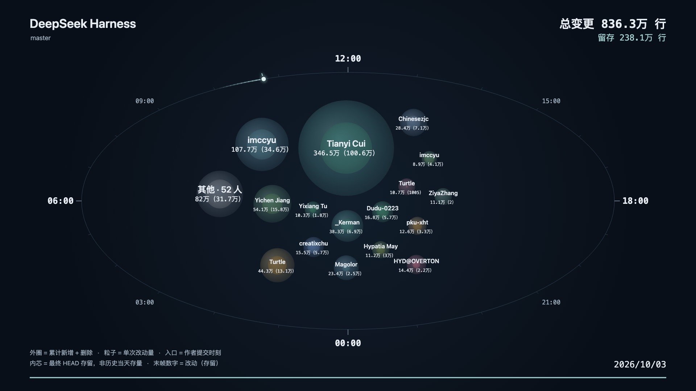

中文 | [English](README_EN.md)

# Git History Visualizer

把 Git 提交历史变成贡献动效，支持本地交互预览和 1080p MP4 导出。



内置 [DeepSeek Harness](https://github.com/deepseek-ai/deepseek-harness) 示例：12,469 个非合并提交、68 个邮箱身份，播放 60 秒。外层球表示累计改动，内芯表示最终存留；末帧数字为“改动（存留）”。**改动量不等于贡献质量。**

[观看 60 秒演示视频](https://github.com/WANGKenwill/git-history-visualizer/releases/download/v0.1.0/dsh-demo.mp4)

## 快速开始

预先安装 **Node.js 22+（推荐 24）和 Git**，然后运行：

```bash
git clone https://github.com/WANGKenwill/git-history-visualizer.git
cd git-history-visualizer
npm run setup -- --start
```

首次准备需要联网，会安装 npm 依赖及 Chromium。macOS 缺少 FFmpeg 时通过已有 Homebrew 安装；其他系统需自行安装 FFmpeg、ffprobe，Linux 还需准备 Chromium 系统库。平台验证：macOS arm64 已实测；Ubuntu 已通过 CI 安装和测试；Windows 尚未验证。

<details>
<summary>Ubuntu / Debian 依赖准备（进入源码目录后执行）</summary>

预先安装 Node.js 22+，然后运行：

```bash
sudo apt-get update && sudo apt-get install -y git ffmpeg
npm ci
npx playwright install --with-deps chromium
npm run studio
```

Chromium 系统依赖使用 [Playwright 官方安装方式](https://playwright.dev/docs/browsers#install-system-dependencies)。

</details>

以后启动只需：

```bash
npm run studio
```

打开 http://127.0.0.1:4173 即可播放示例。macOS 自动打开浏览器；追加 `-- --no-open` 可关闭自动打开。请通过 HTTP 使用，勿直接打开 HTML 文件。自定义端口可设置 `GIT_HISTORY_PORT`。

## 使用

右上角可切换中文 / English，首次跟随浏览器语言，之后记住选择。界面、预览和新导出视频使用同一语言；切换不需要重新分析。

1. 选择本地 Git 仓库，或填写远程 GitLab 地址并点击“读取分支”；私有仓库按需填写 Token。
2. 选择分支、时长、时区和显示人数，点击“生成可视化”。默认显示 16 个作者，其余汇总为“其他”。
3. 播放、拖动或全屏观看；点击作者球查看统计，点击“导出 MP4”保存视频。

生成时显示分析阶段和最终存留的文件进度，命中存留缓存时直接复用。同一时间只执行一个分析任务。下载、更新或补全远程历史超过 5 分钟会提示重试；失败不会替换上次可视化结果。

同名不同邮箱默认独立，可在账号关联中手动合并后重新生成。密集提交的粒子可能短暂遮挡文字，可暂停或拖动查看。

支持普通仓库、worktree 和裸仓库。浅克隆需先点击“补全历史（联网）”或手动执行 `git fetch --unshallow`；分析不会自动补全。远程分析会下载完整分支历史并缓存，可能占用较多磁盘空间。

视频保存到 `exports/`，格式为 1920×1080、30 fps、H.264。预览和导出共用绘制函数，末帧呈现完整累计量。同一时间只执行一个导出任务。导出在本地服务后台执行，刷新或关闭页面不会取消已启动的任务；重新打开页面会恢复进度和下载入口。导出期间离开页面会请求浏览器显示确认提示，停止本地服务则会中断导出，重启后需重新导出。恢复的成品标为“上次导出”，文件不存在时会明确提示。

展开“添加配乐”可选择本地音频（最大 100 MB，支持 MP3、WAV、M4A 等本地 FFmpeg 可读取的格式），显示文件名和时长。音频短于视频时循环，长于视频时截断，导出为 AAC 音轨；未选择音频时仍导出无声视频。可点击“视频时长设为音频时长”（15–180 秒），立即调整当前预览和导出的时间轴，无需重新分析仓库。预览播放时同步播放配乐，暂停、拖动进度、重播和重新生成时间轴时保持同步；预览需要浏览器支持所选音频格式，无法播放时会提示更换文件。选择的文件仅临时保存到本机，移除、更换或服务退出时清理，同一标签页刷新后会核验并恢复配乐；服务重启后需重新选择。

提交时区可搜索城市名或 IANA 标识，常用时区置顶。已有数据恢复保存的时区，首次使用默认本机时区；列表展示当前 UTC 偏移，历史提交按对应日期的时区规则计算。搜索不改变当前选择，需在下拉列表中确认。

## 统计口径

- 统计目标分支 HEAD 可达的非合并提交，按 SHA 去重；改动量＝新增＋删除行数。
- 二进制不计行数；排除锁文件、vendor、node_modules、构建产物和覆盖率目录。
- 作者按小写邮箱识别；squash 只归属仓库保留的作者，不推测原始贡献者。
- 按作者时间排列历史，压缩空闲时段；时间环表示配置时区中的提交时刻，可能与实际开发时间不同。
- 存留通过最终 HEAD 的 Git blame 计算，包含空行与注释；它不是历史当天的代码存量，也不代表贡献质量。不启用跨文件复制追踪或忽略空白修改。
- 同一提交、原始文件与原始行号只计一次贡献存留。重复副本、合并冲突解决等无法归属贡献事件的行列为“未纳入贡献事件”；完整存留＝已映射贡献存留＋未纳入量。画布显示已映射量，页面概览显示完整总量。

## 数据与隐私

服务仅监听本机 `127.0.0.1`，只开放必要页面、脚本和导出视频。Token 不写入文件或凭据存储助手，仅传入 Git 子进程环境；请使用输入框，不要将 Token 放进 URL。

浏览器自动请求的 favicon 返回 204，Chrome DevTools 探测地址返回空 404，不打印异常。其他静态资源访问拒绝／缺失只记录请求方法、路径和状态，不记录查询参数或完整堆栈；未知异常继续保留诊断堆栈。私有文件与符号链接仍禁止访问。

分析结果和仓库缓存保存在 `.cache/`，不会改写内置示例。启动时优先加载上次分析结果。数据包含作者姓名、邮箱、提交说明和仓库路径，分享前请检查，勿提交私有数据或凭据。

依赖准备后，本地分析、预览和导出可离线使用；远程读取、克隆和更新需要联网。普通启动和导出不会自动安装依赖。

内置示例固定于 DSH 的 `master` 分支提交 [`5badb150`](https://github.com/deepseek-ai/deepseek-harness/commit/5badb15009ae1756c3afe0ae0cef1faafc290ccc)，保留公开作者信息，不含源码或本机路径，不自动更新。

## 开发与贡献

```bash
npm run check       # 统计、界面及视频导出测试
npm run licenses    # 更新第三方许可证声明
```

导出按固定时间逐帧绘制，将原始 Canvas 像素通过本地连接交给 FFmpeg，省去 PNG 压缩、Base64 中转和 PNG 解码。浏览器通过内容安全策略限制资源与连接为同一来源，导出不访问外部网络。

测试需要已安装的 Chromium 和 FFmpeg。也可使用 CLI：

```bash
npm run analyze -- /absolute/path/to/repository main
npm run render -- .cache/current/manifest.json exports/history.mp4
```

- 小修复直接提交 PR，较大功能先开 Issue；问题报告请附环境、复现步骤和预期结果，优先使用合成仓库。
- 统计或时间轴改动补回归测试；预览与导出保持一致。导出改动额外验证短视频解码、时长及末帧累计量。
- 依赖变化后更新许可证声明。提交信息用中文，PR 说明验证结果，视觉改动附截图；勿提交缓存、私有历史、凭据或本机路径。
- 使用或行为变化时同步更新中英文 README。

安全漏洞请发送至 [kenwillwang@gmail.com](mailto:kenwillwang@gmail.com)，请勿在公开 Issue 中附上 Token、私有仓库数据或可利用的漏洞细节。

## 许可

[MIT License](LICENSE)，版权人 WANGKenwill。npm 依赖声明见 [第三方许可证](LICENSES_THIRD_PARTY.md)。Git、Chromium 和 FFmpeg 由用户独立安装，不随源码分发。
